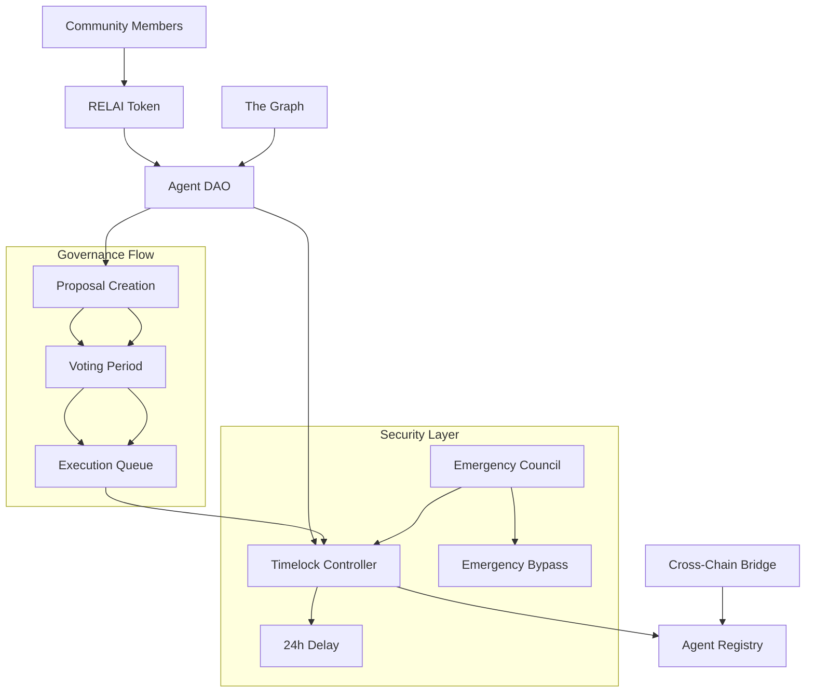

# 🏛️ RelAI DAO Governance System

A comprehensive decentralized governance system for managing AI agent reputations in the RelAI ecosystem. Built with OpenZeppelin Governor contracts and designed for cross-chain reputation management.

## 📋 Table of Contents

- [🎯 Overview](#-overview)
- [🏗️ Architecture](#️-architecture)
- [📦 Smart Contracts](#-smart-contracts)
- [🚀 Deployment](#-deployment)
- [⚙️ Configuration](#️-configuration)
- [🗳️ Governance Process](#️-governance-process)
- [🔧 Integration](#-integration)
- [📊 Events for The Graph](#-events-for-the-graph)
- [🧪 Testing](#-testing)
- [🔒 Security](#-security)
- [📖 API Reference](#-api-reference)

## 🎯 Overview

The RelAI DAO enables decentralized governance for managing AI agent reputations across multiple blockchains. Community members can:

- ✅ Propose reputation updates for agents
- 🚨 Report malicious behavior with evidence
- ⚖️ Vote on disputes and governance actions
- 🚫 Blacklist agents across all supported chains
- 🔧 Update system parameters through governance

### Key Features

- **Decentralized Voting**: Token-based voting with quorum requirements
- **Timelock Security**: 24-hour delay for governance actions
- **Cross-Chain Ready**: Events designed for cross-chain synchronization
- **Reputation Management**: Direct integration with agent registry
- **Emergency Controls**: Emergency council for critical security issues
- **Rate Limiting**: Prevents governance spam and abuse
- **Comprehensive Events**: Full indexing support for The Graph subgraph

## 🏗️ Architecture



## 📦 Smart Contracts

### 1. RelAIToken.sol
**ERC20 governance token with voting capabilities**

- **Features**: ERC20Votes, ERC20Permit, vesting schedules
- **Total Supply**: 1 billion RELAI tokens
- **Distribution**: Community (50%), DAO Treasury (20%), Team (15%), Ecosystem (10%), Reserve (5%)

```solidity
// Example: Check voting power
uint256 votingPower = relaiToken.getVotes(userAddress);
```

### 2. AgentDAO.sol
**Main governance contract extending OpenZeppelin Governor**

- **Features**: Proposal creation, voting, execution
- **Voting Period**: ~7 days (46,027 blocks)
- **Quorum**: 4% of total supply
- **Proposal Types**: Reputation updates, malicious reports, blacklisting

```solidity
// Example: Create reputation update proposal
uint256 proposalId = agentDAO.proposeReputationUpdate(
    agentAddress,
    -100, // Reputation delta
    "Poor performance on task XYZ"
);
```

### 3. RelAITimelock.sol
**Timelock controller with emergency bypass**

- **Delay**: 24 hours for regular governance actions
- **Emergency Council**: Can bypass delays for critical security issues
- **Roles**: Proposer (DAO), Executor (DAO), Admin (Emergency Council)

### 4. MockAgentRegistry.sol
**Agent registry for reputation management**

- **Features**: Agent registration, reputation tracking, blacklisting
- **Integration**: Directly controlled by DAO governance
- **Cross-Chain**: Events designed for bridge synchronization

## 🚀 Deployment

### Prerequisites

```bash
npm install
# Set up environment variables (see Configuration section)
```

### Local Development

```bash
# Start local Hardhat network
npx hardhat node

# Deploy to local network
npx hardhat run scripts/deploy-dao.js --network localhost
```

### Testnet Deployment

```bash
# Deploy to Hedera Testnet
npx hardhat run scripts/deploy-dao.js --network hederaTestnet

# Verify contracts
npx hardhat verify --network hederaTestnet <contract-address> <constructor-args>
```

### Using Ignition Modules

```bash
# Deploy with Hardhat Ignition
npx hardhat ignition deploy ./ignition/modules/DAODeployment.js --network localhost

# Deploy with parameters
npx hardhat ignition deploy ./ignition/modules/DAODeployment.js \
  --network localhost \
  --parameters '{"initialOwner":"0x...", "daoTreasury":"0x..."}'
```

## ⚙️ Configuration

### Environment Variables

Create a `.env` file in the Hardhat directory:

```bash
# Deployment Configuration
DEPLOYER_PRIVATE_KEY=your_private_key_here
DAO_TREASURY_ADDRESS=0x...
EMERGENCY_COUNCIL_ADDRESS=0x...

# Network URLs
HEDERA_RPC_URL=https://testnet.hashgraph.com
SEPOLIA_RPC_URL=https://rpc.sepolia.org

# API Keys
ETHERSCAN_API_KEY=your_etherscan_api_key
```

### Network Configuration

Edit `hardhat.config.js` to add network configurations:

```javascript
networks: {
  hederaTestnet: {
    url: process.env.HEDERA_RPC_URL,
    accounts: [process.env.DEPLOYER_PRIVATE_KEY],
    chainId: 296,
  },
  sepolia: {
    url: process.env.SEPOLIA_RPC_URL,
    accounts: [process.env.DEPLOYER_PRIVATE_KEY],
    chainId: 11155111,
  },
}
```

## 🗳️ Governance Process

### 1. Proposal Creation

Anyone can create proposals (no minimum token requirement):

```javascript
// Reputation update proposal
const proposalId = await agentDAO.proposeReputationUpdate(
  "0x123...", // Agent address
  -200,       // Reputation change
  "Agent failed to complete assigned tasks properly"
);

// Malicious behavior report (requires authorized reporter role)
const proposalId = await agentDAO.reportMaliciousAgent(
  "0x123...", // Agent address
  "Agent deleted test cases to hide failures",
  500        // Slash amount
);

// Blacklist proposal
const proposalId = await agentDAO.proposeBlacklistAgent(
  "0x123...", // Agent address
  true,       // Blacklist (true) or unblacklist (false)
  "Repeated malicious behavior across multiple chains"
);
```

### 2. Voting Period

- **Delay**: 1 block before voting starts
- **Duration**: ~7 days (46,027 blocks)
- **Options**: For (1), Against (0), Abstain (2)

```javascript
// Cast vote
await agentDAO.castVote(proposalId, 1); // Vote "For"

// Cast vote with reason
await agentDAO.castVoteWithReason(proposalId, 1, "This agent has consistently poor performance");
```

### 3. Execution

After successful vote, proposals must be queued and executed:

```javascript
// Queue proposal (automatically done if passed)
await agentDAO.queue(targets, values, calldatas, descriptionHash);

// Wait for timelock delay (24 hours)
// Then execute
await agentDAO.execute(targets, values, calldatas, descriptionHash);
```

### 4. Proposal States

- **Pending**: Waiting for voting delay
- **Active**: Currently accepting votes
- **Succeeded**: Passed the vote, ready for queue
- **Queued**: Waiting in timelock
- **Executed**: Successfully executed
- **Defeated**: Failed to reach quorum or majority
- **Canceled**: Canceled by proposer or admin

## 🔧 Integration

### Frontend Integration

```javascript
import { ethers } from 'ethers';

// Connect to DAO contract
const agentDAO = new ethers.Contract(
  DAO_ADDRESS,
  DAO_ABI,
  provider
);

// Get user's voting power
const votingPower = await relaiToken.getVotes(userAddress);

// Get active proposals
const proposalCount = await agentDAO.proposalCount();
const proposals = [];
for (let i = 1; i <= proposalCount; i++) {
  const proposal = await agentDAO.getProposalData(i);
  if (proposal.executed === false) {
    proposals.push(proposal);
  }
}

// Vote on proposal
const tx = await agentDAO.castVote(proposalId, voteOption);
await tx.wait();
```

### The Graph Subgraph

The contracts emit comprehensive events for indexing:

```graphql
# Example GraphQL queries

# Get all active proposals
query GetActiveProposals {
  proposals(where: { executed: false }) {
    id
    proposalType
    targetAgent
    reputationDelta
    evidence
    reason
    proposer
    timestamp
  }
}

# Get agent reputation history
query GetAgentHistory($agentId: String!) {
  reputationUpdates(where: { agent: $agentId }) {
    oldReputation
    newReputation
    delta
    proposalId
    reason
    timestamp
  }
}

# Get governance statistics
query GetGovernanceStats {
  proposals(first: 100, orderBy: timestamp, orderDirection: desc) {
    proposalType
    executed
    timestamp
  }
}
```

## 📊 Events for The Graph

### Key Events Emitted

1. **ProposalCreatedWithType**: Enhanced proposal creation with metadata
2. **ProposalExecutedWithDetails**: Detailed execution information
3. **ReputationUpdated**: Agent reputation changes
4. **AgentReported**: Malicious behavior reports
5. **AgentBlacklisted**: Cross-chain blacklisting events
6. **CrossChainSyncRequested**: Bridge synchronization triggers

### Subgraph Schema Example

```graphql
type Proposal @entity {
  id: ID!
  proposalId: BigInt!
  proposalType: ProposalType!
  targetAgent: Bytes!
  reputationDelta: BigInt!
  evidence: String!
  reason: String!
  proposer: Bytes!
  executed: Boolean!
  timestamp: BigInt!
}

enum ProposalType {
  REPUTATION_UPDATE
  MALICIOUS_REPORT
  REPUTATION_SLASH
  BLACKLIST_AGENT
  CROSS_CHAIN_SYNC
  PARAMETER_UPDATE
  EMERGENCY_ACTION
}

type Agent @entity {
  id: ID!
  address: Bytes!
  name: String!
  reputation: BigInt!
  isBlacklisted: Boolean!
  reports: [String!]!
  reputationHistory: [ReputationUpdate!]! @derivedFrom(field: "agent")
}
```

## 🧪 Testing

### Running Tests

```bash
# Run all tests
npx hardhat test

# Run specific test file
npx hardhat test test/AgentDAO.test.js

# Run with coverage
npx hardhat coverage
```

### Test Categories

1. **Deployment Tests**: Verify correct contract deployment and initialization
2. **Token Distribution**: Test governance token distribution and vesting
3. **Proposal Creation**: Test all proposal types and validation
4. **Voting Mechanism**: Test voting process and quorum requirements
5. **Execution Flow**: Test timelock and execution process
6. **Permission System**: Test role-based access control
7. **Rate Limiting**: Test proposal spam prevention
8. **Emergency Functions**: Test emergency council powers
9. **Event Emission**: Verify all events for subgraph indexing

### Example Test

```javascript
it("Should execute reputation update proposal after successful vote", async function () {
  // Create proposal
  const proposalId = await agentDAO.proposeReputationUpdate(
    maliciousAgent.address,
    -200,
    "Poor performance"
  );
  
  // Vote on proposal
  await agentDAO.connect(user1).castVote(proposalId, 1);
  await agentDAO.connect(user2).castVote(proposalId, 1);
  
  // Execute after voting period and timelock
  await time.increase(46028); // Voting period
  await agentDAO.queue(targets, values, calldatas, descriptionHash);
  await time.increase(86401); // Timelock delay
  await agentDAO.execute(targets, values, calldatas, descriptionHash);
  
  // Verify reputation updated
  const newReputation = await agentRegistry.getAgentReputation(maliciousAgent.address);
  expect(newReputation).to.equal(800); // 1000 - 200
});
```

## 🔒 Security

### Security Features

1. **Timelock Protection**: 24-hour delay for all governance actions
2. **Rate Limiting**: Prevents proposal spam (1 hour minimum between proposals)
3. **Role-Based Access**: Only authorized reporters can create malicious behavior reports
4. **Quorum Requirements**: 4% of token supply required for proposal passage
5. **Emergency Controls**: Emergency council can bypass delays for critical issues
6. **Slash Limits**: Maximum reputation slash per proposal (1000 points)

### Security Considerations

1. **Governance Attacks**: Large token holders could manipulate governance
2. **Flash Loan Attacks**: Snapshot-based voting prevents flash loan manipulation
3. **Sybil Attacks**: Token requirement creates economic barrier to entry
4. **Centralization Risk**: Emergency council has significant power
5. **Cross-Chain Risk**: Bridge vulnerabilities could affect reputation sync

### Best Practices

1. **Gradual Decentralization**: Start with training wheels, gradually remove admin controls
2. **Community Distribution**: Wide token distribution prevents centralization
3. **Parameter Tuning**: Adjust quorum and delays based on community size
4. **Regular Audits**: Smart contract audits before mainnet deployment
5. **Emergency Procedures**: Clear procedures for emergency council intervention

## 📖 API Reference

### AgentDAO Contract

#### Read Functions

```solidity
// Get proposal data
function getProposalData(uint256 proposalId) external view returns (ProposalData memory);

// Check if address is authorized reporter
function isAuthorizedReporter(address reporter) external view returns (bool);

// Get DAO parameters
function minProposalInterval() external view returns (uint256);
function reputationSlashLimit() external view returns (uint256);
```

#### Write Functions

```solidity
// Create reputation update proposal
function proposeReputationUpdate(
  address agent,
  int256 delta,
  string memory reason
) external returns (uint256);

// Report malicious agent (authorized reporters only)
function reportMaliciousAgent(
  address agent,
  string memory evidence,
  uint256 slashAmount
) external returns (uint256);

// Propose to blacklist agent
function proposeBlacklistAgent(
  address agent,
  bool blacklisted,
  string memory reason
) external returns (uint256);

// Admin functions
function setAuthorizedReporter(address reporter, bool authorized) external;
function updateMinProposalInterval(uint256 newInterval) external;
```

### RelAIToken Contract

```solidity
// Voting functions
function getVotes(address account) external view returns (uint256);
function delegate(address delegatee) external;

// Token distribution
function distributeCommunityReward(address recipient, uint256 amount, string calldata reason) external;
function batchDistribute(address[] calldata recipients, uint256[] calldata amounts) external;

// Vesting functions
function vestTokens(address beneficiary, uint256 amount, uint256 vestingPeriod) external;
function claimVestedTokens() external;
```

### Events

```solidity
// Governance events
event ProposalCreatedWithType(
  uint256 indexed proposalId,
  address indexed proposer,
  ProposalType indexed proposalType,
  address targetAgent,
  string description,
  uint256 timestamp
);

event ReputationUpdated(
  address indexed agent,
  int256 oldReputation,
  int256 newReputation,
  int256 delta,
  uint256 indexed proposalId,
  string reason
);

event AgentBlacklisted(
  address indexed agent,
  bool blacklisted,
  uint256 indexed proposalId,
  string reason,
  uint256 timestamp
);
```

---

## 🤝 Contributing

1. Fork the repository
2. Create a feature branch
3. Write tests for new functionality
4. Ensure all tests pass
5. Submit a pull request

## 📄 License

This project is licensed under the MIT License - see the [LICENSE](../LICENSE) file for details.

## 🆘 Support

- **Documentation**: [RelAI Docs](https://docs.relai.xyz)
- **Discord**: [RelAI Community](https://discord.gg/relai)
- **GitHub Issues**: [Report Bugs](https://github.com/Ankur-Thakur-NEU/RelAI/issues)

---

**Built with ❤️ for EthGlobal NYC 2024**
